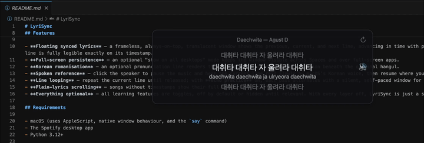

# SottoVoce

Synced lyrics for the Spotify desktop app on macOS, in a floating window built for language learners.

<p align="center">
  
</p>

## Features

- **Synced lyrics that float** — a frameless, always-on-top window shows the previous, current and next line, in time with playback.
- **Lives in the menu bar**, not the Dock. The window shrinks into the menu bar item when you hide it and grows back out of it when you return. The item's glyph says three things at once, and each independently: its shape says whether a song is playing, its brightness says whether the lyrics are on screen, and a dot says a practice mode is running. Optionally the shape steps along as the lyric advances. Right-clicking the window gives you the same menu.
- **Looks like macOS** — real vibrancy behind the lyrics, follows light and dark, and the sung line stays readable over a white document, a dark editor or video.
- **Follows your accessibility settings**, live, the way it follows light and dark. Reduce Motion takes out the flight to the menu bar, the travel to a remembered position and the rise of each lyric, and leaves the fades. Reduce Transparency swaps the vibrancy for a solid panel. Increase Contrast lifts every text role to the 4.5:1 the sung line already promised, and draws the window's edge as an edge.
- **⇧⌘J from anywhere** shows and hides the lyrics without switching away from what you were doing. No Accessibility permission.
- **Album colour** — an optional layer that colours the window from the current cover's hue.
- **Show on all desktops** — an optional mode that keeps the window visible across Spaces and over full-screen apps.
- **Yield to notifications** — an optional layer that fades the window out of the way while a notification banner or the Notification Centre is over it, and brings it back when the way is clear. Only when the window is actually in the corner notifications use; parked anywhere else, it stays put. It needs no permission: the window list answers "is a notification on screen" without the Screen Recording prompt, and the app never asks for a window's title, which is the one field that would need it.
- **Remember position per app** — an optional layer that puts the window back where you last left it for whichever app you switch to. It learns by watching you drag it; there is nothing to save. The edge of the window warms for a moment when a position is recorded, and the menu lists the apps it knows by name and icon — so there is no guessing whether it took.
- **Korean romanisation** — an optional pronunciation line under the current lyric.
- **Spoken reference** — pause the music and hear the current line read slowly, then carry on.
- **Line looping and echo practice** — repeat a line, or alternate hearing it with a silent turn to sing it yourself.
- **Tap-to-sync** — a song with plain lyrics only can be timed by hand. Your timings are saved and used from then on.
- **A reason, if you want one** — when a lookup fails the window says "lyrics unavailable, will retry", and nothing else, because that is all most people need. Beside it is a small ⓘ: click it and it says which of the four things went wrong (an HTTP status, a timeout, an unreachable server, an unreadable answer) and which attempt in the fallback chain it came from. A song that simply has no lyrics says so plainly and offers nothing to click.
- **Everything optional** — every learning feature is a toggle. With them all off, this is a simple synced-lyrics window.

## Requirements

- macOS 11 or later (macOS 13+ for Open at Login)
- The Spotify desktop app
- Python 3.12+

## Install

### Build it yourself

```sh
git clone git@github.com:matt-huang1/sottovoce.git
cd sottovoce
python3 -m venv .venv
.venv/bin/pip install -e ".[build,dev]"
make test          # optional, and the point of the dev extra
make app
mv dist/SottoVoce.app /Applications/
```

There are two extras and they are not interchangeable. `build` is PyInstaller, which only `make app` needs; `dev` is pytest, which only `make test` needs. Installing `".[build]"` alone builds a working app and then fails the suite with `No module named pytest`, which is a missing extra rather than a broken checkout. Neither extra is needed to *run* the app — `pip install -e .` is enough for that.

An app you build on your own Mac is never marked as downloaded, so macOS has no reason to question it: **it opens with an ordinary double-click and there is no security warning to click through.** No certificate, keychain or Xcode needed either — `make app` renders the icon, freezes the bundle and signs it ad-hoc in one step.

This is also the route that requires trusting nobody: you can read what you are about to run.

### Or download the release

[**LyriSync-1.0.0.zip**](https://github.com/matt-huang1/sottovoce/releases/download/v1.0.0/LyriSync-1.0.0.zip) (36 MB) — built from the `v1.0.0` tag. Check it before opening it:

```sh
shasum -a 256 ~/Downloads/LyriSync-1.0.0.zip
# 52f7ac2bb5665d9b787d27c6a1c92d8cd22d0eadf21da677d52a1a15cba9482e
```

1.0.0 was published before this app was renamed, so the zip and the app
inside it are still called **LyriSync** — the hash is a fact about those
bytes and is not re-pointed by a rename. The next release carries the new
name.

That hash is written down here and nowhere else; it changes with every
re-upload ([how a release is made](docs/releasing.md)).

The app is signed **ad-hoc, not with an Apple Developer ID, and it is not notarised.** macOS will therefore refuse to open a downloaded copy on first launch. That is Gatekeeper working as intended, and getting past it is a decision to make deliberately rather than a step to follow — [docs/gatekeeper.md](docs/gatekeeper.md) explains what the block means, the two ways round it, and what notarisation would and would not have told you.

### Either way

On its first poll, macOS asks for **Automation** permission ("SottoVoce wants to control Spotify"). This one is not a trust warning but a capability grant, and the app genuinely needs it: it is how the current track and playback position are read. Moving the app afterwards can make macOS ask again, so put it where you want it first.

For the spoken-reference feature, install the Korean system voice **Yuna** (System Settings → Accessibility → Spoken Content → System Voice → Manage Voices…). Without it, that one feature quietly disables itself.

### Upgrading from LyriSync

This app used to be called LyriSync. Your window position, size, opacity and every toggle are carried over the first time the renamed app runs: macOS keys a preferences file on the app's identifier, so the rename orphaned the old file rather than moving it, and the app copies it across once. Copied, not moved — the old file is left exactly where it is.

Two things no app can carry, because macOS keys them on the identifier *and* the signature:

- **Automation.** You are asked again on first poll, this time for SottoVoce. The old entry stays in System Settings → Privacy & Security → Automation until you remove it.
- **Open at Login.** Switch it back on from the menu. The stale LyriSync entry lingers in System Settings → General → Login Items until the old app is deleted.

Your lyrics cache and any syncs you tapped out by hand are files on disk, not preferences, and the rename does not touch them.

### Running from a checkout

What development uses:

```sh
.venv/bin/pip install -e ".[dev]"
.venv/bin/sottovoce
make test
```

The `dev` extra is pytest and nothing else; drop it if you only want to run the app. It shares settings with the bundled app, so window position and every toggle carry over. More in [docs/packaging.md](docs/packaging.md).

## Usage

Play something in Spotify and the window follows along.

- **⇧⌘J** hides and shows the lyrics from any app, full-screen ones included. Nothing takes focus and SottoVoce never comes to the front.
- **The menu bar item** is the app's home — every setting is there, including Open at Login in the built app, and entries appear only where they apply. Right-clicking the window gives the same menu.
- **Drag** anywhere to move, **drag the edges** to resize (text scales with width), **scroll** to dim. In the plain-lyrics view, scroll moves the lyrics and Option+scroll dims.
- **↻** repeats the current line; the **speech bubble** speaks it aloud.
- **Sync this song** (right-click) times a song by hand: the track restarts, and you tap the wide bar as each line begins. ↩ undoes a tap, ✕ abandons the pass. Finish the last line and it saves itself. Once a song has your sync, the entry becomes **Re-sync this song**.

Two terminal tools exist for debugging: `sottovoce-monitor` and `sottovoce-lyrics`. `SOTTOVOCE_LOG=DEBUG` makes the running app explain itself line by line — which app came to the front, what was remembered for it, and why anything it declined to do was declined.

## Architecture

A worker thread polls the Spotify desktop app with one batched AppleScript call every ~300 ms — no Web API, no credentials. Lyrics come from [LRCLIB](https://lrclib.net), cached locally by track ID; syncs you tap out yourself live separately in `.user_syncs/` and are never treated as cache. The monitor and the lyrics provider know nothing about the UI. Display state, timing, menu gating, the type scale, geometry and the colour palettes live in pure, Qt-free modules behind a thin PySide6 window — which is why the contrast floor is a test rather than a judgement, and why the whole suite runs headless on Linux CI without touching the network, your settings or your Spotify ([how many, and how](docs/testing-and-ci.md)).

## Documentation

The reasoning, the trade-offs and the measurements live in **[docs/](docs/)** — one page per topic. Good places to start:

| | |
|---|---|
| [Design philosophy](DESIGN_PHILOSOPHY.md) | the twelve principles the rest is downstream of |
| [Architecture](docs/architecture.md) | modules, threads, what knows about what |
| [Contrast and accessibility](docs/contrast-and-accessibility.md) | the 4.5:1 promise, and every number behind it |
| [Album colour](docs/album-colour.md) | hue-only tinting, and the two bugs that shaped it |
| [Testing and CI](docs/testing-and-ci.md) | the guards that keep the suite off your Spotify |
| [Changelog](CHANGELOG.md) | the milestones in order |

Also in `docs/`: [Spotify integration](docs/spotify-integration.md), [lyrics and caching](docs/lyrics-and-caching.md), [tap-to-sync](docs/tap-to-sync.md), [appearance and materials](docs/appearance-and-materials.md), [motion and typography](docs/motion-and-typography.md), [per-app window position](docs/per-app-position.md), [yielding to notifications](docs/notification-yield.md), [the hotkey and Carbon](docs/hotkey-and-carbon.md), [the menu and system integration](docs/menu-and-system-integration.md), [the learning layers](docs/learning-features.md), [packaging](docs/packaging.md), [releasing](docs/releasing.md), and [Gatekeeper](docs/gatekeeper.md).

## Credits

Lyrics by [LRCLIB](https://lrclib.net). Romanisation by [korean-romanizer](https://github.com/osori/korean-romanizer).

## License

[MIT](LICENSE)
